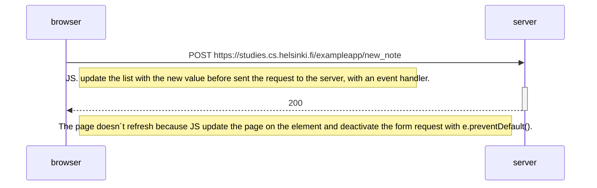

```mermaid
sequenceDiagram
participant browser
participant server

    browser->>server: POST https://studies.cs.helsinki.fi/exampleapp/new_note
    Note right of browser: JS. update the list with the new value before sent the request to the server, with an event handler.
    activate server
    server-->>browser: 200
    deactivate server

    Note right of browser: The page doesn´t refresh because JS update the page on the element and deactivate the form request with e.preventDefault().
```
